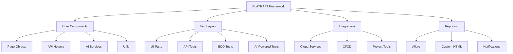
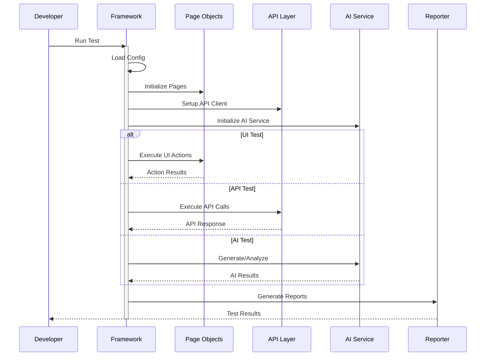
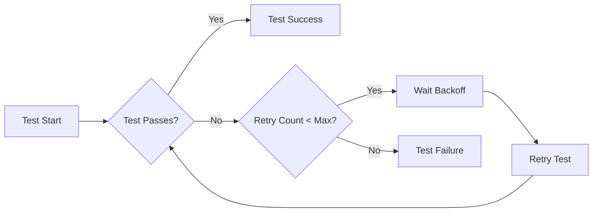
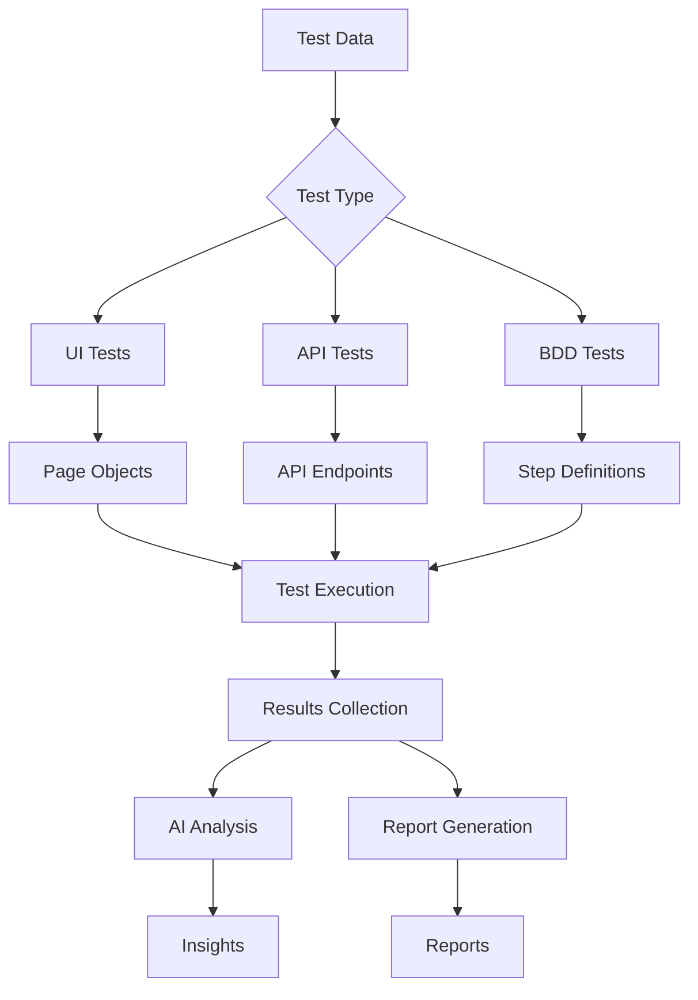

# PLAYRAFT - Playwright Reusable Automation Framework for Testing

A comprehensive enterprise-grade test automation framework built on Playwright with TypeScript, enabling robust testing across web, API, and mobile interfaces.

## 📊 Framework Architecture



## 🔄 Test Execution Flow



## 🔍 Test Retry Mechanism



## 🌟 Key Features

### Core Testing Capabilities
- **Cross-Browser Testing**: Chromium, Firefox, WebKit, and mobile browsers
- **API Testing**: Built-in REST/GraphQL API testing infrastructure
- **Visual Testing**: Screenshot comparison and visual regression
- **Mobile Testing**: Responsive design validation and mobile emulation
- **Performance Testing**: Load, stress, and performance metrics collection
- **Accessibility Testing**: WCAG compliance validation
- **Security Testing**: Basic security validation capabilities

### AI Integration
- **Test Generation**: AI-powered test case generation using OpenAI GPT-4o
- **Smart Analysis**: Intelligent test result analysis and pattern detection
- **Visual Analysis**: AI-based UI anomaly detection
- **Test Data Generation**: Dynamic test data creation with realistic values
- **Code Generation**: Automated test script generation from natural language
- **Self-Healing**: AI-powered element locator maintenance

### Architecture & Design
- **Page Object Model**: Enhanced POM with component-based architecture
- **BDD Support**: Cucumber integration with Gherkin syntax
- **Data-Driven**: External test data management and parameterization
- **Modular Design**: Reusable components and utilities
- **Type Safety**: Full TypeScript implementation
- **Clean Code**: ESLint and Prettier integration

### Enterprise Integration
- **Cloud Testing**:
  - BrowserStack integration
  - LambdaTest support
  - Custom cloud provider support
- **CI/CD**:
  - Jenkins pipeline support
  - GitHub Actions workflows
  - Azure DevOps integration
- **Reporting**:
  - Allure reporting
  - Custom HTML reports
  - ReportPortal integration
  - PDF report generation
- **Notifications**:
  - Slack integration
  - Email notifications
  - MS Teams integration
- **Project Management**:
  - Jira integration
  - Azure DevOps work items
  - TestRail integration

### Advanced Features
- **Parallel Execution**: Multi-threaded test execution
- **Retry Mechanism**: Smart test retry with exponential backoff
- **Screenshots & Videos**: Automatic capture on failure
- **Network Interception**: Request/response monitoring
- **Performance Metrics**: Browser performance data collection
- **Memory Management**: Efficient resource cleanup
- **Error Handling**: Comprehensive error management
- **Logging**: Advanced logging with Winston

## 📁 Framework Structure

```plaintext
playraft/
├── ai/                         # AI Testing Components
│   ├── services/              # AI Service Integration
│   │   └── openai.service.ts  # OpenAI Integration
│   └── utils/                 # AI Utilities
│       ├── AIHelper.ts        # AI Testing Helper
│       └── AITestResultsAnalyzer.ts
├── api/                       # API Testing Infrastructure
│   ├── config/               # API Configuration
│   ├── endpoints/            # API Endpoints
│   ├── helpers/              # API Testing Helpers
│   └── models/               # API Data Models
├── config/                   # Framework Configuration
│   ├── browser/             # Browser Configuration
│   └── env/                 # Environment Settings
├── features/                # BDD Feature Files
│   ├── api/                # API Features
│   └── ui/                 # UI Features
├── integrations/           # External Integrations
│   ├── aws/               # AWS Services
│   ├── jira/              # Jira Integration
│   └── slack/             # Slack Notifications
├── pages/                 # Page Objects
│   ├── base/             # Base Page Classes
│   └── components/       # Reusable Components
├── reports/              # Test Reports
│   ├── allure/          # Allure Reports
│   └── html/            # Custom HTML Reports
├── tests/               # Test Implementation
│   ├── aitest/         # AI-Powered Tests
│   ├── apitest/        # API Tests
│   └── uitest/         # UI Tests
└── utils/              # Utilities
    ├── logger/         # Logging System
    └── reporter/       # Reporting Utilities
```

## 🚀 Getting Started

### Prerequisites

- Node.js 18+
- npm or yarn
- Visual Studio Code (recommended)

### Installation

1. Clone the repository:
```bash
git clone https://github.com/yourusername/playraft.git
```

2. Install dependencies:
```bash
npm install
```

3. Install Playwright browsers:
```bash
npx playwright install
```

### Configuration

1. Create environment configuration:
```bash
cp .env.example .env
```

2. Configure environment variables:
```properties
# Base Configuration
BASE_URL=https://your-app-url.com
TEST_ENV=dev

# Browser Settings
BROWSER=chromium
HEADLESS=true
VIEWPORT_WIDTH=1920
VIEWPORT_HEIGHT=1080

# Timeouts
DEFAULT_TIMEOUT=30000
NAVIGATION_TIMEOUT=30000

# Reporting
SCREENSHOT_ON_FAILURE=true
VIDEO_RECORDING=true
TRACE_ENABLED=true

# OpenAI Configuration
OPENAI_API_KEY=your_api_key

# Cloud Testing
BROWSERSTACK_USERNAME=your_username
BROWSERSTACK_ACCESS_KEY=your_access_key
```

### Running Tests

#### Standard Test Execution

Run all tests:
```bash
npm test
```

Run specific test types:
```bash
npm run test:api      # API tests
npm run test:ui       # UI tests
npm run test:ai       # AI-powered tests
npm run test:bdd      # BDD tests
```

#### Parallel Execution

Run tests in parallel:
```bash
npm run test:parallel
```

#### Reporting

Generate Allure report:
```bash
npm run report:allure
```

Generate HTML report:
```bash
npm run report:html
```

## 🔧 Framework Configuration

### Browser Configuration

```typescript
// config/browser/config.ts
export const browserConfig = {
  viewport: { width: 1920, height: 1080 },
  recordVideo: { dir: 'videos/', size: { width: 1280, height: 720 } },
  screenshot: 'only-on-failure',
  trace: 'retain-on-failure'
};
```

### API Configuration

```typescript
// config/api/config.ts
export const apiConfig = {
  baseUrl: process.env.API_BASE_URL,
  timeout: 30000,
  retries: 3,
  headers: {
    'Content-Type': 'application/json'
  }
};
```

## 📚 Usage Examples

### Page Object Model

```typescript
// pages/login.page.ts
export class LoginPage extends BasePage {
  // Page elements
  private readonly usernameInput = '[data-test="username"]';
  private readonly passwordInput = '[data-test="password"]';
  private readonly loginButton = '[data-test="login-button"]';

  // Actions
  async login(username: string, password: string): Promise<void> {
    await this.fill(this.usernameInput, username);
    await this.fill(this.passwordInput, password);
    await this.click(this.loginButton);
  }
}
```

### API Testing

```typescript
// tests/api/auth.test.ts
test.describe('Authentication API', () => {
  test('should login successfully', async ({ request }) => {
    const response = await request.post('/api/login', {
      data: {
        username: 'testuser',
        password: 'testpass'
      }
    });
    expect(response.status()).toBe(200);
  });
});
```

### BDD Testing

```gherkin
# features/login.feature
Feature: User Authentication
  Scenario: Successful Login
    Given I am on the login page
    When I enter valid credentials
    Then I should be logged in successfully
```

## 🛠 Advanced Features

### AI Test Generation

```typescript
// tests/ai/generate.test.ts
const testCase = await aiHelper.generateTest({
  feature: 'Login',
  scenario: 'Validate password requirements',
  complexity: 'high'
});
```

### Custom Reporting

```typescript
// utils/reporter/custom.reporter.ts
export class CustomReporter implements Reporter {
  onTestEnd(test: TestCase, result: TestResult): void {
    // Custom reporting logic
  }
}
```

### Performance Monitoring

```typescript
// tests/performance/metrics.test.ts
test('page load performance', async ({ page }) => {
  const metrics = await page.metrics();
  expect(metrics.FirstContentfulPaint).toBeLessThan(1000);
});
```

## 🔒 Security & Best Practices

### Environment Management
- Secure credential storage
- Environment-specific configurations
- Secret management

### Code Quality
- TypeScript strict mode
- ESLint configuration
- Code review guidelines

### Testing Best Practices
- Test isolation
- Data cleanup
- Resource management
- Error handling

## 📊 Reporting Features

### Allure Report
- Test execution summary
- Failed test analysis
- Screenshot attachments
- Performance metrics

### Custom HTML Report
- Interactive dashboard
- Trend analysis
- Filter capabilities
- Export options

## 🤝 Contributing

1. Fork the repository
2. Create your feature branch
3. Commit your changes
4. Push to the branch
5. Create a Pull Request

## 📈 Data Flow



## 📄 License

This project is licensed under the MIT License.

## 🙏 Acknowledgements

- Playwright team
- OpenAI team
- Community contributors
